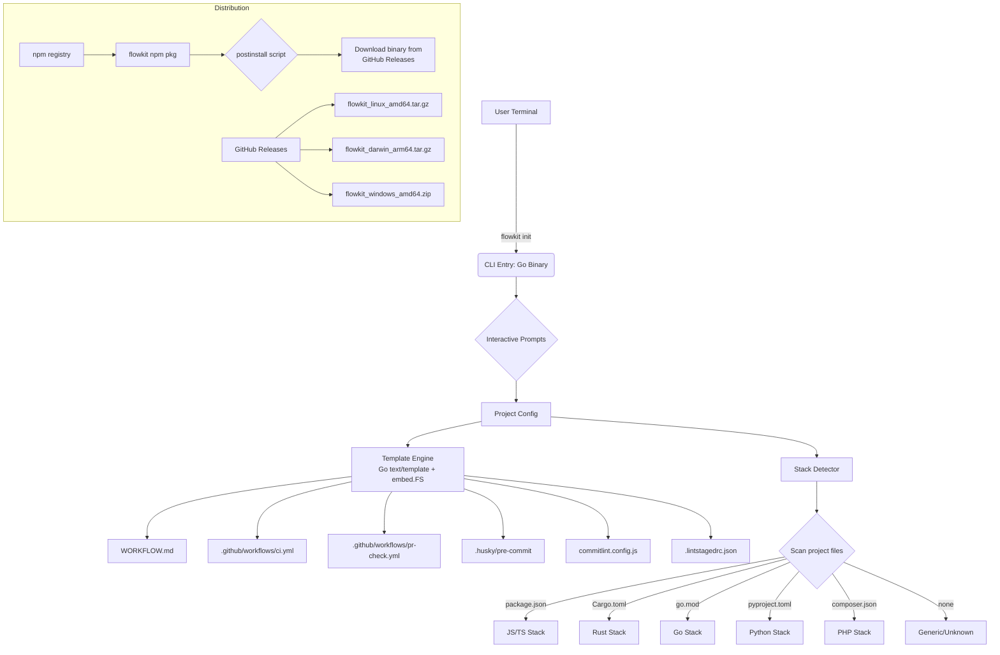

# 📑 flowkit – Product Requirements Document (PRD)

> **PRD Version:** 1.0  
> **Author:** [Nama Anda]  
> **Status:** DRAFT  
> **Date:** 2026-06-28  
> **Tech Stack Focus:** Go (core), Node.js/npm (wrapper), GitHub Actions, Husky

---

## 1. Overview & Vision

- **Problem Statement:** Developer menyia-nyiakan waktu setup git workflow, CI/CD, dan git hooks setiap bikin project baru. Solusi existing: template copy-paste manual (error-prone, gampang lupa 1 step), CLI scaffold yang terlalu opinionated (CRA, `create-next-app`), atau dokumentasi yang cuma dibaca terus diabaikan. Output bash script `sed` sekarang juga rawan error kalo path/command mengandung `/` dan ga cross-platform.

- **Proposed Solution:** CLI tool `flowkit` yang ngescaffold **3 layer workflow** (document → automate → enforce) dalam 1 perintah interaktif. Auto-detect tech stack, generate WORKFLOW.md + CI pipeline + git hooks yang langsung work, tanpa copy-paste manual.

- **User Persona:** Full-stack developer, tech lead, DevOps engineer — yang setup project baru atau standarisasi workflow di project existing. Bisa non-JS (Go, Rust, Python, Laravel).

- **Value Proposition:**
  - Dokumentasi + automation + enforcement dalam 1 command
  - Single binary (Go), zero runtime dependency
  - Bisa via `npx flowkit` (JS dev) atau `go install` / GitHub Releases (semua dev)
  - Tidak hanya generate dokumen — output-nya functional (CI jalan, hooks aktif)

---

## 2. Core Constraints & Tech Stack

### 🛠️ Tech Stack Selection

| Layer | Pilihan | Alasan |
|-------|---------|--------|
| **Core CLI** | Go (`text/template`, `embed`) | Single binary, cross-compile, no runtime, stdlib kuat buat CLI |
| **npm wrapper** | Node.js (thin package.json) | Download binary sesuai platform dari GitHub Releases |
| **Template engine** | Go `text/template` / `embed` | Built-in, no dependency |
| **CI target** | GitHub Actions (`.yml`) | Paling universal, free |
| **Git hooks target** | Husky (JS project) / shell hooks (non-JS) | Minimal setup, version controlled |

### ⚠️ Distribution Constraints

- **Go binary:** Wajib cross-compile untuk `linux/amd64`, `linux/arm64`, `darwin/amd64`, `darwin/arm64`, `windows/amd64`
- **npm package:** Tidak berisi Go source — hanya thin wrapper yang download binary pas `npm install` / `npx`
- **GitHub Releases:** Setiap rilis harus upload semua varian binary + checksum
- **CI auto-generated:** V1 hanya support GitHub Actions. GitLab CI / Bitbucket Pipelines = v2

### ⚠️ Functional Constraints

- **Input sanitasi:** Semua input user (project name, path, command) WAJIB di-escape proper — `sed` replacement sama sekali tidak dipakai (pake `text/template`)
- **Tidak ada dependency runtime:** Go binary tidak boleh require Node, Python, atau runtime apapun
- **Tidak ada telemetry:** V1 tidak collect data pengguna
- **Init execution:** Setelah binary terdownload, `flowkit init` harus selesai < 2 detik

---

## 3. System Architecture & Component Diagram



---

## 4. Configuration Schema

### `flowkit.json` (generated after `init`, bisa di-edit user)

```json
{
  "version": "1.0",
  "project_name": "my-app",
  "main_branch": "master",
  "workflow_style": "gitflow",
  "stack": "next",
  "features": {
    "ci": true,
    "pr_check": true,
    "commit_hooks": true,
    "workflow_doc": true
  },
  "paths": {
    "workflow_doc": "WORKFLOW.md",
    "ci": ".github/workflows/ci.yml",
    "pr_check": ".github/workflows/pr-check.yml"
  },
  "commands": {
    "install": "npm install",
    "dev": "npm run dev",
    "build": "npm run build",
    "lint": "npm run lint"
  }
}
```

### Data Dictionary

| Field | Type | Required | Description |
|-------|------|----------|-------------|
| `version` | string | Yes | Schema version untuk migrasi config |
| `project_name` | string | Yes | Nama project — dipakai di template header |
| `main_branch` | string | Yes | `main` atau `master` |
| `workflow_style` | enum | Yes | `gitflow` / `github-flow` / `trunk-based` |
| `stack` | enum | Yes | `next` / `react` / `vue` / `nuxt` / `laravel` / `go` / `rust` / `python` / `node` / `unknown` |
| `features` | object | Yes | Boolean flag tiap komponen yang mau digenerate |
| `commands` | object | Yes | Perintah spesifik project — dipakai di template CI & WORKFLOW.md |

---

## 5. Feature Requirements (Modular & P-Specs)

### [F-01] Interactive Init Command (`flowkit init`)

- **Priority:** P0 (Must-Have untuk MVP)
- **User Story:** Sebagai developer, saya ingin menjalankan 1 command dan menjawab beberapa pertanyaan — lalu semua file workflow langsung tergenerate.
- **Functional Requirements:**

1. Jalankan `flowkit init` dari root project — mode interactive dengan prompt bertahap (Go library: `charmbracelet/huh` atau `AlecAivazis/survey/v2`)
2. Default values untuk tiap prompt: `main_branch=master`, `language=en`, `workflow_style=gitflow`
3. Auto-detect stack dari file yang ada di direktori — kalo gagal detect, fallback ke `unknown`
4. Setelah semua input, tampilkan summary konfirmasi sebelum generate file
5. Generate file sesuai konfigurasi — jangan overwrite kalo file sudah ada (kecuali flag `--force`)
6. Output daftar file yang berhasil dibuat + next steps

- **AI Technical Execution Steps:**
  - Struktur Go: `cmd/root.go`, `cmd/init.go`, `internal/prompts/`, `internal/generator/`, `internal/detector/`
  - Template disimpan di `internal/templates/` via `//go:embed`
  - Non-interactive mode via flag: `--project-name`, `--main-branch`, dll

- **Error Handling:**
  - Kalo direktori tujuan sudah ada file `flowkit.json` tanpa `--force`, tampilkan error: `"flowkit.json already exists. Use --force to overwrite."`
  - Kalo Go embed gagal load template, panic dengan pesan jelas (internal error — bukan user mistake)
  - Kalo user cancel di tengah prompt (Ctrl+C), exit clean tanpa generate file

### [F-02] Stack Auto-Detection

- **Priority:** P0 (Must-Have)
- **User Story:** Saya tidak perlu bilang project saya pake stack apa — flowkit tau sendiri dari file yang ada.
- **Functional Requirements:**

1. Scan direktori untuk file signature:
   - `package.json` + `"next"` dependency → `next`
   - `package.json` + `"react"` dependency (tanpa next) → `react`
   - `package.json` + `"vue"` dependency → `vue`
   - `package.json` + `"nuxt"` dependency → `nuxt`
   - `package.json` (tanpa framework) → `node`
   - `Cargo.toml` → `rust`
   - `go.mod` → `go`
   - `pyproject.toml` atau `requirements.txt` → `python`
   - `composer.json` → `laravel`
   - Tidak ada → `unknown`

2. Hasil deteksi dipakai untuk:
   - Template CI yang sesuai
   - Default commands di prompt

- **Error Handling:**
  - Kalo file ada tapi corrupt/tidak bisa dibaca, fallback ke `unknown` + tampilkan warning
  - Multiple framework terdeteksi — prioritaskan JS/TS. Tampilkan note.

### [F-03] Multi-Workflow Template Styles

- **Priority:** P1 (Should-Have untuk MVP)
- **User Story:** Saya mau milih workflow yang cocok sama tim saya — GitFlow, GitHub Flow, atau Trunk-Based.
- **Functional Requirements:**

1. Tiga style workflow:
   - **GitFlow** (`main` + `develop`, feature branch dari develop, merge ke develop → PR ke main)
   - **GitHub Flow** (hanya `main`, feature branch → PR langsung ke main. Deploy tiap merge)
   - **Trunk-Based** (hanya `main`, branch pendek < 1 hari, pair programming)

2. Setiap style punya template `WORKFLOW.md` berbeda
3. Pilihan ditanyakan di prompt init

- **AI Technical Execution Steps:**
  - Template file: `templates/workflows/{gitflow,github-flow,trunk-based}/WORKFLOW.md`
  - MVP: GitFlow + GitHub Flow dulu. Trunk-Based = P2.

- **Error Handling:**
  - Kalo style yang dipilih tidak dikenali, fallback ke GitFlow + warning

### [F-04] CI Pipeline Generation

- **Priority:** P0 (Must-Have)
- **User Story:** Setelah init, saya mau langsung push dan CI udah jalan — tanpa setup manual di GitHub.
- **Functional Requirements:**

1. Generate `.github/workflows/ci.yml` sesuai stack:
   - **JS/TS:** `npm ci` → `npm run lint` → `npm run build` → `npm test`
   - **Rust:** `cargo check` → `cargo clippy` → `cargo build` → `cargo test`
   - **Go:** `go vet` → `go build` → `go test`
   - **Python:** `pip install` → `ruff check` → `pytest`
   - **Laravel:** `composer install` → `php artisan lint` → `phpunit`

2. Trigger: `push` ke semua branch (v1). `pull_request` optional — flag.

3. Cache dependency path sesuai stack

- **AI Technical Execution Steps:**
  - Template per stack: `templates/ci/{next,react,go,rust,python,laravel,generic}.yml`
  - Stack detector mapping: `detector.Stack` → `ci.TemplateFile`
  - Variable substitution: `{{INSTALL_COMMAND}}`, `{{BUILD_COMMAND}}`, `{{LINT_COMMAND}}`, `{{MAIN_BRANCH}}`

- **Error Handling:**
  - Kalo stack `unknown`, generate CI generic yang cuma checkout doang — dengan comment "Please configure build steps in this file"
  - Kalo file `.github/workflows/` sudah ada, skip + daftar di output sebagai "skipped (already exists)"

### [F-05] Git Hooks Generation

- **Priority:** P1 (Should-Have)
- **User Story:** Saya mau tiap commit otomatis cek lint & format — biar CI ga nolak gara-gara prettier.
- **Functional Requirements:**

1. Generate pre-commit hook (lint-staged):
   - JS/TS: `.husky/pre-commit` → `npx lint-staged` + `.lintstagedrc.json`
   - Non-JS: `.githooks/pre-commit` → shell script yang jalanin format/check sesuai stack

2. Generate commit-msg hook (commitlint):
   - JS/TS: `.husky/commit-msg` → `npx commitlint --edit $1`
   - Non-JS: `.githooks/commit-msg` → regex check format `type(scope): message`

- **AI Technical Execution Steps:**
  - Template: `templates/hooks/{pre-commit,commit-msg}.sh`
  - Husky hanya digenerate kalo terdeteksi JS/TS + `package.json` sudah ada
  - Non-JS: shell hooks di `.githooks/` — lebih universal
  - Setup command di output

- **Error Handling:**
  - Kalo `.husky/` atau `.githooks/` sudah ada, skip dengan warning
  - Kalo `git` belum init, generate file + inform: "Git hooks generated but git repo not found. Run `git init` first."

### [F-06] npm Distribution Wrapper

- **Priority:** P1 (Should-Have)
- **User Story:** Saya developer JS/TS — saya pengen install cukup `npm i -g flowkit` atau `npx flowkit`.
- **Functional Requirements:**

1. npm package `flowkit` dengan `bin` entry point:
   ```json
   {
     "name": "flowkit",
     "bin": { "flowkit": "./bin/run.js" }
   }
   ```

2. `bin/run.js`:
   - Deteksi platform (`os.platform() + os.arch()`)
   - Mapping ke binary name
   - Cek apakah binary sudah ada di `node_modules/.bin/flowkit` — kalo belum, download dari GitHub Releases
   - Eksekusi binary dengan `spawn`

3. Platform mapping:
   | Platform | Arch | File |
   |----------|------|------|
   | win32 | x64 | `flowkit_windows_amd64.zip` |
   | darwin | arm64 | `flowkit_darwin_arm64.tar.gz` |
   | darwin | x64 | `flowkit_darwin_amd64.tar.gz` |
   | linux | x64 | `flowkit_linux_amd64.tar.gz` |
   | linux | arm64 | `flowkit_linux_arm64.tar.gz` |

- **AI Technical Execution Steps:**
  - Satu file `package.json` minimal — dependencies: zero
  - `bin/run.js` — pure Node.js native API, no npm packages
  - Download URL: `https://github.com/{owner}/flowkit/releases/latest/download/{filename}`
  - Verifikasi checksum dari GitHub Release

- **Error Handling:**
  - Kalo platform tidak dikenal: "Unsupported platform. Install via `go install github.com/{owner}/flowkit@latest`"
  - Kalo download gagal (network error), retry 1x — kalo masih gagal: "Failed to download flowkit binary."
  - Checksum mismatch: "Binary corrupted. Re-run `npm install flowkit`."

---

## 6. User Flow & State Management

### Init Flow (Primary)

```text
$ flowkit init
  ↓
? Project name: [my-app]
? Main branch: [main]
? Language: [English / Indonesia]
? Workflow style: [GitFlow / GitHub Flow / Trunk-Based]
? Generate CI pipeline? [Yes]
? Generate pre-commit hooks? [Yes]
  ↓
→ Detected stack: Next.js
  ↓
Summary:
  Project      : my-app
  Stack        : Next.js
  Workflow     : GitFlow
  CI           : Included
  Hooks        : Included
  Language     : English
  ↓
? Looks good? [Yes / No]
  ↓
✓ WORKFLOW.md created
✓ .github/workflows/ci.yml created
✓ .github/workflows/pr-check.yml created
✓ .husky/pre-commit created
✓ commitlint.config.js created
✓ flowkit.json created
  ↓
✅ Done! 6 files generated.
```

### Re-run Flow

```text
$ flowkit init
→ flowkit.json found. Use existing config? [Yes / No / --force]
```

### Non-Interactive Mode

```bash
flowkit init \
  --project-name "my-app" \
  --main-branch main \
  --workflow-style gitflow \
  --language en \
  --ci \
  --hooks \
  --force
```

---

## 7. Non-Functional, Security & Performance Requirements

### Performance

- **Binary size:** Target < 8 MB (compressed). `upx --best` di CI release — target < 3 MB.
- **Init execution:** < 2 detik dari prompt terakhir ke file tergenerate.
- **Prompt latency:** Setiap transisi prompt < 50ms.
- **Template rendering:** < 100ms untuk 10 file sekaligus.

### Security

- **No telemetry:** V1 tidak mengirim data apapun ke internet (kecuali npm wrapper download binary).
- **Checksum verification:** npm wrapper WAJIB verify SHA256 checksum setelah download binary.
- **No code execution:** flowkit hanya generate file teks dan config — tidak menjalankan `npm install`, `git init`, atau perintah lain.
- **Template injection:** Semua input user di-escape via `text/template` — tidak mungkin template injection.

### Cross-Platform

- Windows: Support PowerShell 5.1+, Command Prompt, Git Bash
- macOS: Support darwin/amd64 + darwin/arm64 (Apple Silicon)
- Linux: Support glibc-based distros (Ubuntu, Debian, Fedora, Arch)
- No WSL dependency di Windows

### Maintainability

- Go module: `github.com/{owner}/flowkit`
- CI: GitHub Actions build + test + lint tiap push
- Release: `goreleaser` untuk auto-build + upload ke GitHub Releases + publish npm
- Testing: Go `testing` package untuk unit test + `testscript` untuk integration test (golden files)

---

## 8. Release Strategy & Roadmap

### v0.1 — MVP (alpha)

| Feature | Status |
|---------|--------|
| `flowkit init` interactive | ✅ |
| Stack detection (5 stack) | ✅ |
| GitFlow template only | ✅ |
| Generate WORKFLOW.md | ✅ |
| Generate CI (JS/TS only) | ✅ |
| Generate pre-commit (JS/TS only) | ✅ |
| Cross-compile (5 platforms) | ✅ |
| Go binary release (GitHub) | ✅ |

### v0.2 — Stabilisasi

| Feature | Status |
|---------|--------|
| GitHub Flow + Trunk-Based | ✅ |
| Non-JS stack CI templates (Go, Rust, Python, Laravel) | ✅ |
| Non-JS git hooks (`.githooks/`) | ✅ |
| `--force` flag | ✅ |
| `--non-interactive` mode | ✅ |
| `flowkit.json` config re-read | ✅ |
| Tests + golden files | ✅ |

### v1.0 — Public Launch

| Feature | Status |
|---------|--------|
| npm package (`npx flowkit`) | ✅ |
| `goreleaser` auto-release | ✅ |
| README + docs website | ✅ |
| Demo GIF / recording | ✅ |
| MIT License | ✅ |

### v2.0 — Future

| Feature | Status |
|---------|--------|
| GitLab CI support | 📋 |
| Dockerfile generation | 📋 |
| Terraform/Vagrant dev env | 📋 |
| VS Code extension | 📋 |

---

*End of PRD — flowkit*
