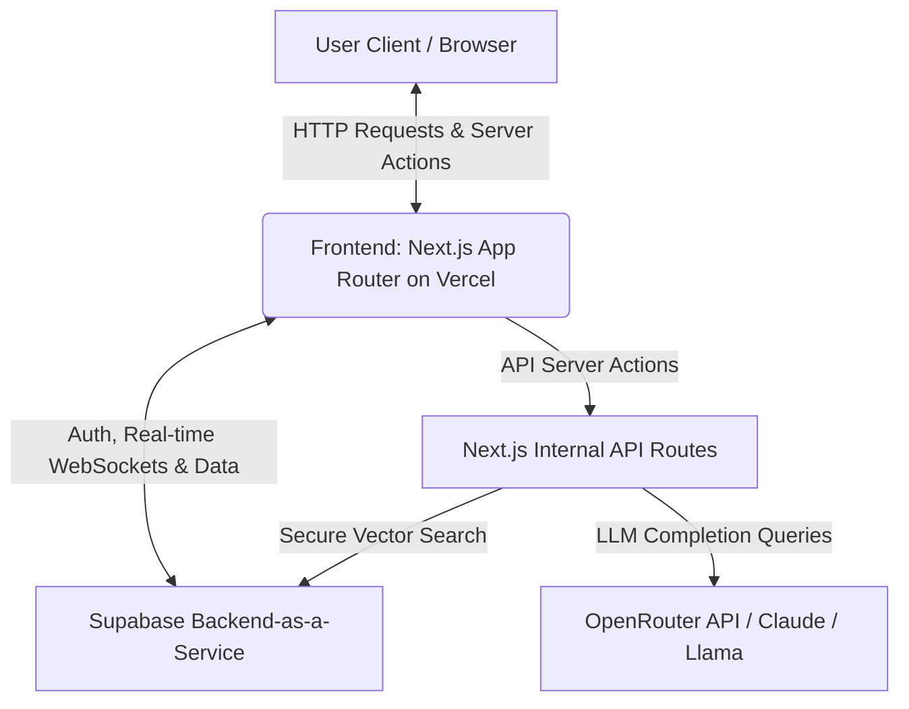
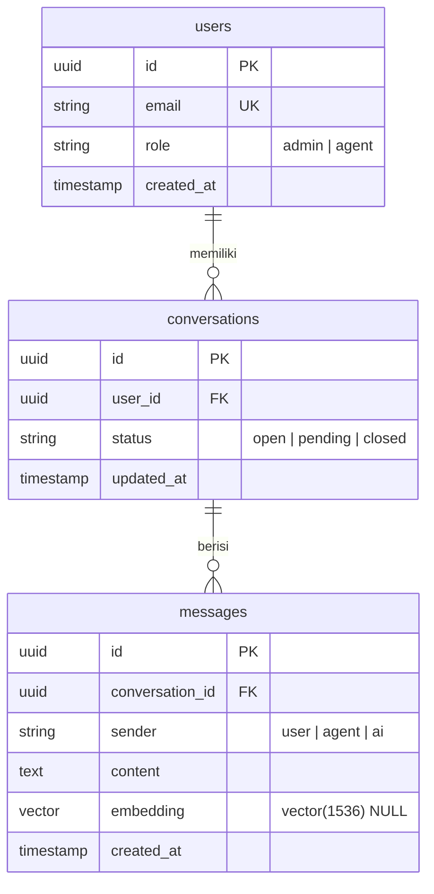

# 📑 [NAMA PROJEK] – Product Requirements Document (PRD)

> **PRD Version:** 1.0  
> **Author:** [Nama Anda / Tim]  
> **Status:** DRAFT / REVIEW / APPROVED  
> **Date:** [Tanggal Terbaru]  
> **Tech Stack Focus:** [Misal: Next.js, Supabase, Tailwind, OpenRouter]

---

## 1. Overview & Vision

_Bagian ini memberikan konteks tingkat tinggi agar Developer manusia memahami tujuan bisnis, dan AI Agent memahami arah pembuatan arsitektur program secara keseluruhan._

- **Problem Statement:** [Jelaskan masalah spesifik yang dihadapi pengguna secara mendetail. Mengapa masalah ini penting untuk diselesaikan?]
- **Proposed Solution:** [Jelaskan bagaimana aplikasi/fitur ini menyelesaikan masalah tersebut. Gambarkan solusi ideal dari perspektif produk.]
- **User Persona:** [Siapa target pengguna utama? Misal: Agen Customer Service, Administrator, End-user non-teknis.]
- **Value Proposition:** [Apa nilai unik dari aplikasi ini dibanding solusi yang sudah ada? Fokus pada efisiensi, biaya, atau kemudahan.]

---

## 2. Core Constraints & Tech Stack (CRITICAL FOR AI AGENTS)

_AI Agent membutuhkan batasan (constraints) yang sangat ketat agar tidak menghasilkan kode yang menggunakan pustaka (library) yang salah, struktur yang usang, atau melebihi kuota budget API._

### 🛠️ Tech Stack Selection

- **Frontend Framework:** Next.js (App Router, React Server Components, Server Actions)
- **Styling & UI Components:** Tailwind CSS + `shadcn/ui` (Radix UI primitives)
- **Database & Core Backend:** Supabase (PostgreSQL)
- **Authentication:** Supabase Auth (Email & Password, OAuth jika diperlukan)
- **ORM / Query Builder:** Drizzle ORM / Prisma / Native PostgREST (Pilih salah satu)
- **AI Engine / LLM Provider:** OpenRouter API (Model: `meta-llama/llama-3-8b-instruct:free` / `anthropic/claude-3.5-sonnet`)
- **Vector Database (RAG):** `pgvector` extension bawaan Supabase
- **Notification / Email Service:** Resend SMTP / API

### ⚠️ Infrastructure & Budget Constraints

- **Free-Tier Limits:** Aplikasi harus berjalan optimal di atas batas gratis Supabase (Database 500MB, Storage 1GB).
- **File Upload Limit:** Maksimal ukuran file attachment adalah 2MB untuk menghemat bandwidth dan kapasitas storage.
- **API Rate Limiting:** Batasi panggilan ke AI Engine maksimal 5 kali per menit per user session untuk mencegah eksploitasi token.

---

## 3. System Architecture & Component Diagram

_Gunakan sintaks Mermaid.js di bawah ini. AI Agent sangat andal dalam membaca, menginterpretasikan, dan menerjemahkan diagram Mermaid menjadi struktur folder nyata._

---

## 4. Database Schema & Vector Specifications

_Tuliskan skema database secara eksplisit menggunakan diagram relasi dan kamus data. Ini mempermudah AI Agent untuk langsung membuat file migrasi SQL atau skema ORM._

### Data Dictionary & Technical Rules (Untuk Prompt AI)

- **Tabel `users`:** Kolom `id` harus dipetakan langsung ke `auth.users` milik Supabase Auth melalui Trigger atau foreign key.
- **Tabel `messages`:** Kolom `embedding` bertipe `vector(1536)` untuk mendukung model embedding standar seperti `text-embedding-3-small`. Gunakan ekstensi `pgvector`.
- **Row Level Security (RLS):** Semua tabel WAJIB mengaktifkan RLS. Agen hanya bisa membaca data dari _conversation_ yang ditugaskan kepada mereka.

---

## 5. Feature Requirements (Modular & P-Specs)

_Pecah fitur menjadi blok-blok kecil. Format modular ini dirancang agar Anda bisa langsung melakukan COPY-PASTE satu sub-fitur spesifik ke AI Agent saat proses vibecoding._

### [F-01] AI-Powered Reply Draft (RAG via Vector Search)

- **Priority:** P0 (Must-Have untuk MVP)
- **User Story:** Sebagai Agen CS, saya ingin sistem mendeteksi pesan masuk dan otomatis membuatkan draf balasan berdasarkan dokumen SOP perusahaan, agar saya tidak perlu mencarinya secara manual.
- **Functional Requirements:**

1. Menyediakan tombol "Generate AI Draft" di bawah kolom teks input chatbox.
2. Saat diklik, panggil Server Action yang melakukan _similarity search_ ke tabel `knowledge_embeddings` menggunakan _cosine distance_ (`<=>`).
3. Ambil top 3 potongan dokumen paling relevan dengan tingkat kemiripan (threshold) > 0.7.
4. Kirim potongan teks tersebut sebagai _context_ ke model LLM melalui OpenRouter beserta pesan terakhir dari user.

- **AI Technical Execution Steps (Prompt Guidance):**
- _AI Agent Note:_ Buat fungsi database RPC bernama `match_documents(query_embedding vector, match_threshold float, match_count int)` di database Supabase terlebih dahulu.
- Pastikan komponen UI menggunakan skeleton loader dari `shadcn/ui` saat menunggu respons API.

- **Error Handling:** Jika API OpenRouter mengalami _rate-limited_ (HTTP 429), sistem harus menangkap eror tersebut dan menampilkan _toast notification_: `"Sistem AI sedang sibuk. Silakan coba kembali dalam beberapa saat."` tanpa merusak _state_ chat yang sedang berjalan.

### [F-02] Real-time Chat Refresh

- **Priority:** P0 (Must-Have)
- **User Story:** Sebagai Agen CS, saya ingin pesan baru dari pelanggan muncul secara instan di layar saya tanpa perlu melakukan _refresh_ halaman manual.
- **Functional Requirements:**

1. Memanfaatkan fitur Supabase Realtime _Real-time Changes listeners_.
2. Ketika ada baris baru masuk ke tabel `messages` dengan `conversation_id` yang aktif, langsung _append_ ke dalam _state_ pesan lokal di sisi klien.

---

## 6. User Flow & State Management

_Jelaskan alur perpindahan layar dan manajemen status aplikasi untuk menghindari AI menghasilkan kode halaman yang statis atau membingungkan._

### Alur Autentikasi & Otorisasi

1. User mengakses root URL `/`. Jika belum login, middleware Next.js secara otomatis me-redirect ke halaman `/login`.
2. User memasukkan kredensial -> Supabase mendivalidasi -> Jika sukses, arahkan ke dasbor sesuai _role_ (`/admin` atau `/dashboard`).

### State Management Konteks Tiket

- Aplikasi memiliki global state / React Context untuk melacak `active_conversation_id`.
- Jika status percakapan diubah menjadi `closed`, semua elemen input teks dan tombol AI di halaman tersebut harus otomatis masuk ke _disabled state_ (read-only mode).

---

## 7. Non-Functional, Security & Performance Requirements

- **Performance:** Dasbor utama wajib menggunakan kombinasi _Incremental Static Regeneration (ISR)_ untuk data statis atau _Streaming Server-Side Rendering (SSR)_ dengan React Suspense agar _First Contentful Paint (FCP)_ di bawah 1.2 detik.
- **Security & RLS:** Enforce aturan ketat di database: `auth.uid() = user_id` untuk memastikan proteksi kebocoran data antar agen lintas tim.
- **PWA / Mobile Friendly:** Tampilan antarmuka harus sepenuhnya responsif (Mobile-first breakpoint minimal 320px) menggunakan utility classes Tailwind CSS agar agen tetap dapat membalas pesan melalui smartphone.

---
